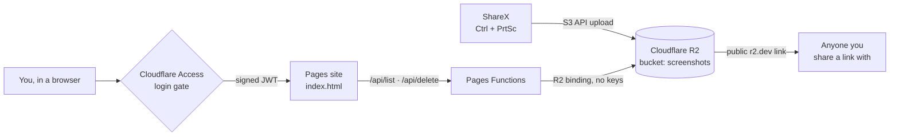

# 📸 Shots

**A self-hosted Gyazo replacement built from ShareX, Cloudflare R2 and about 300 lines of code.**

Press a hotkey, drag a box, and a link is on your clipboard before you've let go of the mouse.
Every capture lands in storage you own, and a private gallery lets you browse, copy, and delete
everything you've ever uploaded.
---

## Why this exists

Gyazo went offline after a security breach. That was a good prompt to stop renting a place for
screenshots and own it instead. The goals:

- **Instant links.** Capture → upload → URL in the clipboard, same as before.
- **My storage, my rules.** Files live in my own R2 bucket and nobody else controls them.
- **A private gallery.** Browse everything, like Gyazo Pro, but only I can see the index.
- **Near-zero cost and upkeep.** No homelab dependency, no subscription.

## How it works



There are two separate paths:

| | Who | How |
|---|---|---|
| **Sharing** | Anyone with a link | Individual files are public on the bucket's URL, exactly like a Gyazo link |
| **Browsing** | Only me | The gallery and its API sit behind Cloudflare Access, and the API also checks the Access token itself |

The gallery page never talks to R2 directly and never holds a credential. The Pages Functions
reach the bucket through an **R2 binding**, so there are no API keys in the code, the repo, or the browser.

## Features

- 🗂️ Grid of every upload, newest first, grouped by month
- 🔎 Instant filter by file name
- 🖼️ Full-size lightbox with ← → keyboard navigation and Esc to close
- 🎬 Videos (`.mp4`, `.webm`, `.mov`) play inline with a *video* badge on the tile
- 🔗 One-click **Copy link**, **Open**, and **Delete**
- 🌓 Light and dark mode that follows your system
- 📱 Works on phones
- 📄 Loads 5,000 items at a time, with a *Load more* button beyond that

## What's in the box

```
shots/
├── public/
│   ├── index.html            Gallery markup
│   ├── app.js / app.css      Gallery logic and styles (separate files so the CSP can ban inline code)
│   └── _headers              Security headers: CSP, frame blocking, nosniff, no-referrer, HSTS
├── functions/api/
│   ├── _middleware.js        Verifies the Access JWT, blocks cross-origin writes, hardens responses
│   ├── list.js               GET  /api/list    → objects, newest first, paginated
│   └── delete.js             POST /api/delete  → removes one object
├── tests/api.test.mjs        27 security tests for auth, CSRF and handlers (npm test)
├── .github/                  CI tests, CodeQL scanning, Dependabot, CODEOWNERS
├── SECURITY.md               How to report a vulnerability
└── wrangler.toml             Project name, R2 binding, public URL, Access settings
```

## What it costs

| Piece | Cost |
|---|---|
| R2 storage | Free up to 10 GB per month, then about $0.015/GB. Tens of thousands of screenshots fit in the free tier |
| R2 bandwidth | **Always free.** R2 has no egress fees |
| Pages hosting + Functions | Free tier |
| Cloudflare Access | Free plan (up to 50 users) |
| ShareX | Free and open source |

For comparison, Gyazo Pro is about $4–5/month. *Check Cloudflare's current pricing before relying on these numbers; free tiers change.*

---

## Setting it up from scratch

### 1. R2 bucket
1. Cloudflare dashboard → **R2** → **Create bucket** → `screenshots` (Standard storage class).
2. Bucket → **Settings** → enable the **Public Development URL** (`https://pub-….r2.dev`),
   or better, attach a **Custom Domain**.
3. **R2 → Manage API tokens** → create a token with **Object Read & Write**, scoped to this bucket only.
   Save the Access Key ID, the Secret, and the S3 endpoint.

### 2. ShareX
**Destinations → Destination settings → Amazon S3**

| Field | Value |
|---|---|
| Access key ID / Secret | From the R2 token |
| Endpoint | `<account-id>.r2.cloudflarestorage.com` (hostname only, without `https://` or `/screenshots`) |
| Region | `auto` |
| Bucket | `screenshots` |
| Use path style request | ✅ |
| Set public-read ACL | ❌ (R2 handles public access at the bucket level) |
| Custom domain | Your r2.dev or custom domain URL |

Then set **Destinations → Image uploader** and **File uploader** to **Amazon S3**, and in
**After upload tasks**, tick **Copy URL to clipboard**.

### 3. Deploy the gallery (Pages + GitHub)
1. Push this repo to GitHub.
2. Cloudflare → **Workers & Pages → Create → Pages → Import an existing Git repository**.
   > ⚠️ Make sure you're in the **Pages** flow, not Workers. The Workers flow runs `wrangler deploy` and fails.
3. Build settings: preset **None**, build command *empty*, output directory **`public`**.
4. Deploy. Opening the site should say *"Not authorized"*. That's correct: the API refuses everything until Access is configured.

### 4. Lock it down with Cloudflare Access
1. **Zero Trust → Access → Applications → Add → Self-hosted**
2. Domains: `your-project.pages.dev` **and** `*.your-project.pages.dev` (the second covers preview deploys).
3. Policy: **Allow** → Include → **Emails** → your address. *Nothing else. See troubleshooting below.*
4. Copy the application's **AUD tag** and your **team domain**.

### 5. Configure and push
```toml
# wrangler.toml
PUBLIC_BASE        = "https://pub-xxxxxxxx.r2.dev"
ACCESS_TEAM_DOMAIN = "https://<team>.cloudflareaccess.com"
ACCESS_AUD         = "<AUD tag>"
```
```bash
git commit -am "Configure Access" && git push
```
Every push to `main` redeploys automatically. 🎉

---

## Configuration reference

| Name | Kind | Purpose |
|---|---|---|
| `BUCKET` | R2 binding | The bucket the API lists and deletes from |
| `PUBLIC_BASE` | Variable | Base URL images are served from (no trailing slash) |
| `ACCESS_TEAM_DOMAIN` | Variable | `https://<team>.cloudflareaccess.com`, where the signing keys are fetched and the `iss` claim is checked |
| `ACCESS_AUD` | Variable | The Access application's Audience tag, checked against the token's `aud` claim |
| `DEV_NO_AUTH` | Variable | `true` skips the auth check, **but only for requests to localhost**. It has no effect on the deployed site |

Because `wrangler.toml` is in the repo, it is the source of truth: bindings and variables shown
in the Pages dashboard are read-only.

## Local development
```bash
npm test                                   # security tests, no dependencies needed
echo DEV_NO_AUTH=true > .dev.vars          # only honoured on localhost
npx wrangler r2 object put screenshots/test.png --file some.png --local
npx wrangler pages dev
```
This runs against a **simulated** local bucket, so your real screenshots are never touched.

## How the auth check works

Cloudflare Access puts a signed JWT on every request that passes its gate (the `Cf-Access-Jwt-Assertion`
header or the `CF_Authorization` cookie). `_middleware.js` doesn't just trust that the header exists. It:

1. Fetches Access's public signing keys from `<team>/cdn-cgi/access/certs` (cached for an hour)
2. Verifies the RS256 signature with WebCrypto
3. Checks `aud` matches this application, `iss` matches the team, and the token hasn't expired

If anything fails, it returns `403` with a short, secret-free reason, such as `Forbidden: AUD mismatch`,
so problems are quick to diagnose. If the variables are missing entirely, it fails **closed**.

---

## Troubleshooting (a.k.a. everything that went wrong on day one)

| Symptom | Cause | Fix |
|---|---|---|
| ShareX uploads hang forever, with no error | Endpoint entered as a full URL or with the bucket appended | Use the hostname only, region `auto`, path-style on |
| Upload "succeeds" but nothing appears in R2 | ShareX is sending to a different destination (in my case Flickr, left over from a connection test) | Check the log for `Host: Amazon S3`. Set the Image **and** File uploader to Amazon S3 |
| Build log shows `wrangler deploy` → *Missing entry-point* | The project was created as a **Worker**, not Pages | Delete it and recreate it via the **Pages** flow |
| Repo doesn't appear when connecting Git | Cloudflare's GitHub app isn't allowed to see it | GitHub → Settings → Installed GitHub Apps → Cloudflare → add the repo |
| Access: *"That account does not have access"* | Policy had an extra **Require → Authentication Method: otp** rule. Logging in through the Cloudflare IdP reports no OTP, so the policy fails | Keep only Include → Emails. The Access **Logs** show exactly which rule failed |
| Gallery says *Not authorized*, `/api/list` says *Access is not configured* | The site is running an old build without the variables. Here the project had silently become **disconnected from Git**, so pushes never deployed | Reconnect Git under Pages → Settings → Build, then push an empty commit |
| Stuck in a cached "denied" state | Old Access session | Use `https://<team>.cloudflareaccess.com/cdn-cgi/access/logout` or a private window |

**Debugging tip:** open `/api/list` directly in the browser. Its one-line message tells you which layer is failing.

## Security

See [SECURITY.md](SECURITY.md) for how to report a vulnerability. The short version of the design:

| Layer | What it does |
|---|---|
| **Cloudflare Access** | Nobody reaches the gallery or API without logging in as an allowed email |
| **JWT verification** | The API checks the Access token itself: RS256 signature against Access's published keys, plus `aud`, `iss`, `exp` and `nbf`. It fails closed if unconfigured |
| **CSRF protection** | Writes must come from the site's own origin and be `application/json` |
| **Content-Security-Policy** | No inline code; scripts, styles and API calls only from the site itself; images only from the bucket; can't be framed |
| **No secrets in the repo** | The bucket is reached through a binding. The only credential (ShareX's R2 token) lives on the uploading PC, scoped to one bucket |
| **No dependencies** | Nothing from npm is shipped, so there's no package supply chain to compromise |
| **CI** | Every push runs the security tests and CodeQL. Actions are pinned to commit SHAs and updated by Dependabot |

**About the values in `wrangler.toml`:** the team domain, AUD tag and r2.dev URL are identifiers, not secrets.
The team domain and AUD already appear in the login URL that anyone visiting the site is redirected to, and
the r2.dev URL is in every shared link. Knowing them doesn't get anyone past Access.

**Things to know:**
- Individual image URLs are **public by design**. Use random file names (ShareX `%ra{12}`) so links can't be guessed.
- Deleting a file in the gallery removes it from R2, so any link you've shared to it stops working.
- If you move images to a custom domain, update `PUBLIC_BASE` **and** the image host in `public/_headers`.

## Ideas for later

- [ ] **Custom domain** for images (`i.example.com`) instead of the rate-limited r2.dev URL
- [ ] **Drag-and-drop upload** from the browser, for when I'm not at my ShareX machine
- [ ] **OCR search**: run uploads through Workers AI, store the text in D1, and search it
- [ ] **Albums / tags**
- [ ] **Expiring links** via an R2 lifecycle rule on a `tmp/` prefix
- [ ] Thumbnail generation for faster grids on large libraries

---

<sub>Built on a Saturday in September 2026, the day Gyazo went dark. ☁️</sub>
